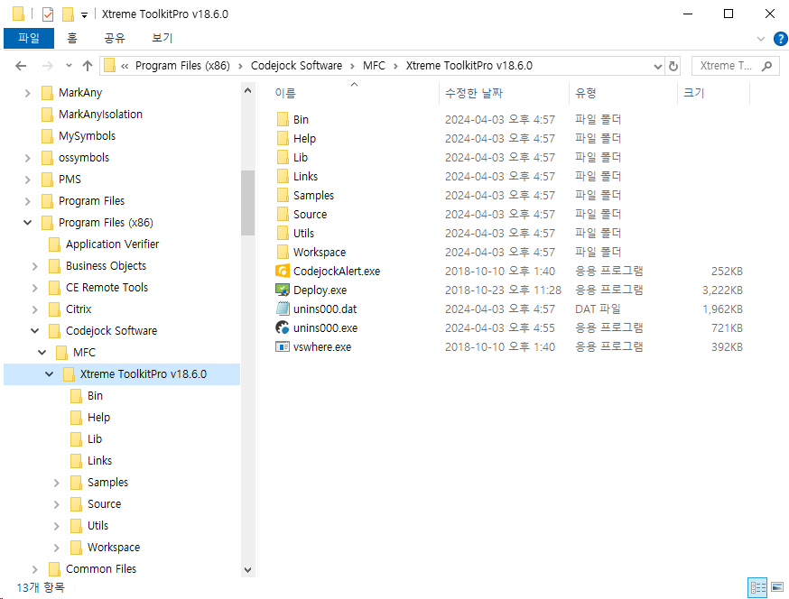
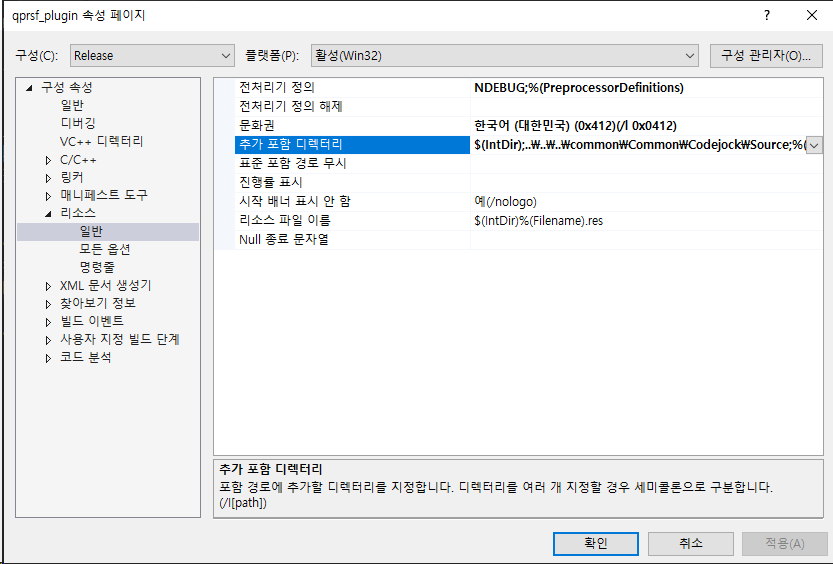

Codejock
---------

### 1. 기본 사항

* 버전
  - 사용 버전 : Xtreme ToolkitPro v18
  - 최근 버전 : Xtreme ToolkitPro V22 (2024년 기준)

* 지원 Visual C++
  - vc90 : vs2008
  - vc140 : vs2015
  - vc150 : vs2017
  - vc160 : vs2019
  - vc170 : vs2022

### 2. 설치



### 3. 빌드
ToolkitPro(1860)(vc90|vc140|vc150)(x64|)(DS|S|)(U|)(D|)

* Codejock라이브러리버전(1860)
  - 1860 버전

* 컴퍼일러버전(vc90|vc140|vc150)
  - vc90 : visual studio 2008
  - vc140 : visual studio 2015
  - vc150 : visual studio 2017
  - vc160 : visual studio 2019
  - vc170 : visual studio 2022

* 비트(x64|)
  - 없음 : x64
  - 없음 : x86

* MFC&런타임&본모듈 Shared/Static여부(DS|S|)
  - DS : static Library (Use MFC in shared DLL)
  - S : static Library (Use MFC in Static Library)
  - 없음 : shared Library

* CharacterSet(U|)
  - U : Unicode
  - 없음 : Multibyte

* 디버그/릴리즈여부(D|)
  - D : Debug
  - 없음 : Release

### 4. 사용법

* XTToolkitPro.h을 include 및 매크로 추가
  ```C++
  #define _XTP_STATICLINK     //*.lib 파일 형태로 정적링크함 - ToolkitPro1860vc150DSU.lib
  #include <XTToolkitPro.h>
    ```

* XTToolkitPro.rc을 include함
  -  프로젝트 속성에 rc 파일의 참조 경로 설정
      ```
      구성 속성 > 리소스 > 일반 탭 > 추가 포함 디렉터리
        ~\Codejock\Source
      ```
      

  -  *.rc2파일에 include문 추가
      ```C++
      //
      // qprsf_plugin.RC2 - Microsoft Visual C++에서 직접 편집하지 않는 리소스
      //
      
      #ifdef APSTUDIO_INVOKED
      #error 이 파일은 Microsoft Visual C++에서 편집할 수 없습니다.
      #endif //APSTUDIO_INVOKED
       
      /////////////////////////////////////////////////////////////////////////////
      // 여기에 수동으로 편집한 리소스를 추가합니다.
      #include "XTToolkitPro.rc"
       
      /////////////////////////////////////////////////////////////////////////////
      ```

### 참고 사이트

* https://forum.codejock.com/
* https://codejock.com/products/toolkitpro/?2yn6s14z=zsp